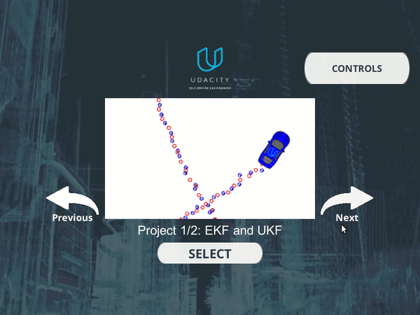

# About

### Problem

Estimate the 2D pose of a car given...

- the landmark map
- noisy measurements of landmarks (x,y)
- noisy odometry data (velocity, yaw-rate)
- noisy initial pose

### Solution approach

Use a particle filter, see https://en.wikipedia.org/wiki/Particle_filter. It works by  ...

- Initialize particles with random poses
- Continuously update these particles
  - Move each particle according to odometry data (and add noise)
  - Updated each particle's likelihood given the sensed landmark positions
  - Resample particles, i.e. clone existing particles based on their likelihood. Thereby, likely particles will have lots of duplicates and unlikely particles will cease to exist

### Result

- My solution passed the test successfully

# FAQ

See detailed instructions in original [original README.org](README_org.md)

### How to install

- Get term2-simulator from https://github.com/udacity/self-driving-car-sim/releases
- Install required websocket library via `install-ubuntu.sh`
- Build project, e.g. via cmake + make

### How to run

- Run `build/particle_filter`
- Start term2-simulator
  - Select "Project 3: Kidnapped Vehicle"
  - Start simulation